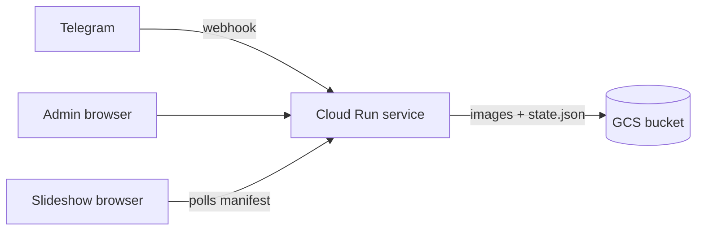
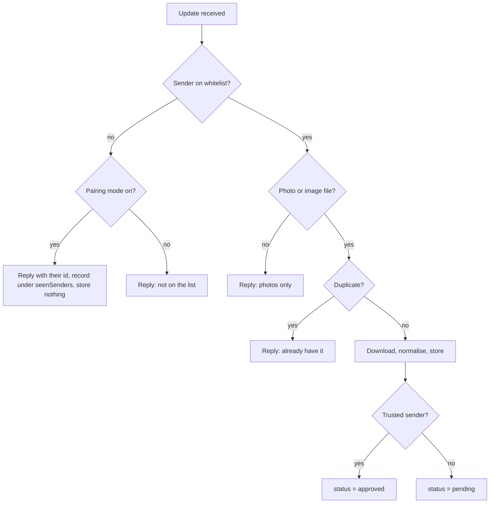

# Event Photo Bot — Technical Spec

## Purpose and scope

Guests on a whitelist send photos to a Telegram bot, an admin approves them, and approved photos run as a slideshow on a projector. The whole web side sits behind one shared password.

**In scope**

- Telegram ingest with a sender whitelist
- Approval queue for incoming photos
- Admin page to approve, show/hide, delete, upload and pin images
- Slideshow page that picks up changes without a manual reload
- Cloud Run deployment via Terraform, images in a GCS bucket

**Out of scope**

- Multiple events, tenancy, per-user accounts, roles beyond the single admin
- Video, animations, stickers — rejected with a polite reply
- Guest-facing gallery or bulk download; pull from the bucket afterwards instead
- Anything that has to survive the event

**Assumptions**

- One event over hours or days. Tens of senders, low hundreds of images.
- The display machine is a laptop with a browser connected to the screen.
- Code and infrastructure are deleted afterwards, so clarity beats extensibility and there is no migration story.

## Architecture

One Cloud Run service does everything: Telegram webhook, admin UI, slideshow, and image serving. One GCS bucket holds both the image bytes and a single `state.json` holding all metadata. There is no database.



The service reads `state.json` once at startup and holds it in memory. Reads are served from memory; every change mutates memory and writes the whole object back. The slideshow polls `/api/manifest` every two seconds with an ETag, so an approval, hide or delete is visible on the next poll.

**Decisions**

| Decision | Choice | Why |
| --- | --- | --- |
| Runtime | ASP.NET Core minimal API, single container | Matches the team's stack; one process, no queue, no worker |
| Instances | min 0, max 1, CPU allocated during requests only | Nothing holds a connection open, so nothing pins an instance. The service bills request time only and costs nothing between events |
| Metadata store | A single `state.json` in the same bucket, held in memory, written with a generation precondition | The manifest is already cached in memory, so no query engine is used. Removes a stateful regional resource that is awkward to delete |
| Live updates | The client polls the manifest every two seconds, conditional on an ETag | A 304 is about a hundred milliseconds of instance time. No streaming endpoint, no fan-out, no reconnect logic |
| Image serving | Proxied through the app, bucket stays private | The password gate has to cover the bytes too, not just the pages |
| Telegram transport | Webhook, secret token header | Cloud Run already gives a public HTTPS URL |

Max instances of 1 caps throughput at one container, far above what tens of guests need, and means a single process owns the state. Default concurrency of 80 is plenty.

That nothing holds a connection open is what the cost model rests on. Cloud Run bills an instance for as long as a request is in flight, so a server-push stream would keep one instance billable for the entire event, while a two-second poll returning 304 bills roughly a hundred milliseconds. Frequent polling also keeps the instance warm at no cost, so scaling to zero only produces a cold start on the first request after a long quiet period — never mid-event with a slideshow open.

The trade is latency: up to two seconds between an approval and the image appearing, against instant with a push stream. At an eight-second slide duration that is imperceptible, and it stays inside the five-second acceptance criterion with room to spare.

A database was the right call for a push-based design that queried on every change. Once the manifest moved into memory, nothing was left that a database provides — no queries, no per-row writes, no listeners, no transactions across entities. A JSON object read once and rewritten on change matches that access pattern exactly, and deletes a regional stateful resource from the teardown path.

The usual objection is lost writes. GCS answers it directly: write with `x-goog-if-generation-match` set to the generation the in-memory copy was loaded from. If anything wrote in between, the call fails with 412, and the handler reloads and reapplies. With max instances of 1 and a write lock in-process that should never fire, but it turns a silent corruption into a retry. Object writes are atomic, so there is no half-written state to read either.

## Data model

One object, `state/state.json`, with two top-level keys: `images` (a map keyed by id) and `settings`. At a few hundred images it is under 100 KB, so rewriting the whole object on every change is cheap.

```json
{ "images": { "<id>": { … } }, "settings": { … } }
```

**`images[id]`**

| Field | Type | Notes |
| --- | --- | --- |
| `id` | string | ULID, also the object name stem |
| `source` | enum | `telegram` or `admin` |
| `senderId` | number | Telegram user id; null for admin uploads |
| `senderName` | string | First name or @username as given at send time |
| `fileUniqueId` | string | Telegram's stable id, used to reject duplicates |
| `sha256` | string | Hash of the normalised image, second duplicate guard |
| `caption` | string | Optional, shown under the image if present |
| `status` | enum | `pending`, `approved`, `hidden`, `rejected` |
| `pin` | enum | `none` or `recurring`. Takeover is not a per-image flag — see `settings.takeoverImageId` |
| `width`, `height` | number | Of the display derivative |
| `receivedAt`, `decidedAt` | string | ISO 8601 UTC |
| `sortKey` | string | Lexical ordering key, defaults to `receivedAt` |

Deleted images are removed from the map and their objects deleted outright. For a throwaway event, a tombstone buys nothing.

Both duplicate guards are dictionary lookups against the in-memory map rather than queries, so ingest does no read of its own. Keep `fileUniqueId` and `sha256` indexes beside the map in memory and rebuild them on load.

**`settings`**

| Field | Default | Notes |
| --- | --- | --- |
| `slideSeconds` | 8 | Per-image dwell time |
| `transitionMs` | 800 | Cross-fade duration |
| `order` | `shuffle` | `shuffle` or `newest-first` |
| `newestFirstBoost` | true | A newly approved image jumps in within one or two slides, then rejoins the pool |
| `recurringEvery` | 10 | Show the recurring pin after this many other images |
| `takeoverImageId` | null | The one image currently taking over the screen |
| `takeoverUntil` | null | ISO 8601; null with a non-null `takeoverImageId` means "until I clear it" |
| `autoApproveTrusted` | false | If on, whitelist entries marked trusted skip the queue |
| `whitelist` | `[]` | Array of `{ id, name, trusted }`. Editable from the admin page |
| `pairingMode` | false | While on, the bot answers any sender with their numeric id and records them under `seenSenders` |
| `seenSenders` | `[]` | Senders observed during pairing mode, as `{ id, name }`, offered to the admin for one-tap adding |

Takeover lives in settings, not on the image, because there can only ever be one. Holding it as a per-image enum would allow two images to claim the screen with nothing to say which wins. Setting it writes `takeoverImageId` and `takeoverUntil` together; clearing it nulls both. Deleting or hiding the image that currently holds takeover must clear it in the same write — with no database there is no referential integrity but the app's own, so that is a rule the delete and hide handlers have to enforce, not an invariant to assume. Takeover requires the image to be `approved`; setting it on a `pending` image approves it in the same write.

There is no `manifestVersion` field. The generation number GCS returns on each write of `state.json` is already a monotonic version, so the app keeps it beside the in-memory copy and serves it as the ETag on `/api/manifest`. One less counter to keep correct.

**Whitelist**

The whitelist lives in `settings.whitelist` and is edited from the admin page. Numeric Telegram user ids rather than usernames, because usernames can be changed or unset.

It was originally an environment variable, which would have meant a redeploy to add a guest — a new revision mid-event, for a change that is one line of state. Keeping it in state makes it an ordinary settings write that takes effect on the next message.

It starts empty, so a fresh deployment accepts nothing until someone is added. That is the safe default: the failure mode of an empty whitelist is a polite decline, while the failure mode of a permissive one is strangers on the projector.

## Telegram bot

The bot receives updates by webhook at an unguessable path, and rejects any request whose `X-Telegram-Bot-Api-Secret-Token` header does not match the configured secret.



**Ingest rules**

- Photo messages carry several sizes; take the largest `file_id`.
- Images sent as documents are accepted if the MIME type is JPEG, PNG, WebP or HEIC. Everything else is declined.
- `getFile` downloads are capped at 20 MB for bots, which comfortably covers compressed photos. Reject larger files with an explanation rather than failing silently.
- Album sends arrive as separate updates with a shared `media_group_id`. Handle each as its own image; group only for the reply, so a five-photo album gets one acknowledgement rather than five.
- The caption, if any, is stored and shown under the image.

**Replies**

One short confirmation per send: accepted and queued, accepted and live, duplicate, or declined with the reason. No commands beyond `/start`, which answers with a line about what the bot is for and whether the sender is on the list.

Rate-limit replies to unlisted senders, in both pairing mode and normal operation. The bot handle is effectively public once it has been shared around, and a decline that answers every message is a free way to make it talk.

**Failure handling**

Do the download, derivatives and writes inside the webhook request, then return 200. CPU is allocated only while a request is in flight, so work deferred past the response would stall — there is no background processing on this deployment shape, and the handler has to finish what it started. If the download fails, still return 200, and reply to the sender with an apology asking them to resend; do not rely on Telegram's retry, which resends the whole update and risks duplicates.

Telegram delivers updates to a bot serially, so a slow handler queues the next one behind it. A five-photo album is processed one image at a time. Measure a single image end to end during testing and multiply by five before trusting the five-second acceptance criterion.

## Web application

**Password gate**

Every path except the Telegram webhook and `/healthz` requires a valid session. Unauthenticated requests get the login page; unauthenticated API calls get 401. One password, compared in constant time against the value from Secret Manager. Success sets a signed, HttpOnly, Secure, SameSite=Lax cookie with a lifetime covering the event, defaulting to 14 days. Rate-limit login to a handful of attempts per IP per minute.

Image bytes are served by the app, not from public bucket URLs, so the gate covers them too.

**Slideshow — `/show`**

- Fullscreen, black background, image fitted with `object-fit: contain` over a blurred copy of itself.
- Sender name and caption in a corner overlay, dismissible via a settings toggle.
- Preloads the next two images so transitions do not stall on a slow fetch.
- Polls `/api/manifest` every two seconds with `If-None-Match`. A 304 is the common case and costs nothing. On a changed ETag it reconciles: removed images disappear after the current slide, newly approved ones are inserted near the front when `newestFirstBoost` is on.
- Keeps the last manifest in memory and keeps running if polls fail, backing off to ten seconds after a few consecutive failures and showing a small corner indicator while offline. Recovery needs no special handling — the next successful poll carries the current state.
- Empty state: a holding card with the QR code or bot handle and a line inviting people to send photos.
- A keep-awake trick (a looping muted video element, or the Wake Lock API where supported) so the display machine does not sleep.

**Approval queue — `/admin/queue`**

Pending images newest first, large enough to judge, each with approve and reject. Keyboard shortcuts for A and R make a backlog fast to clear. Works on a phone, since that is where the admin will be during the event. A badge in the nav shows the pending count, which rides along in the manifest so the admin page polls the same endpoint as the slideshow.

**Image management — `/admin/images`**

Grid of thumbnails filtered by status. Per image: show/hide, delete, set or clear the recurring pin, and take over the screen. Drag-free ordering — sorting is by received time or shuffle, with no manual reorder, to keep the surface small. An upload control accepts files from the admin's own device and marks them approved on arrival.

While a takeover is active, show a persistent banner at the top of every admin page naming the image and offering a one-tap clear. A takeover set with "until I clear it" and then forgotten is the most likely way to end up with one photo on the wall for an hour.

**Forced image**

Two mechanisms, because the two use cases differ.

- **Recurring pin** — the menu or programme, shown every `recurringEvery` images. Several images may hold a recurring pin; they rotate through the slot. This is a per-image flag, since any number of images can carry it.
- **Takeover** — one image shown alone until cleared, or until `takeoverUntil` passes. Set from the management page with a duration picker offering 5, 15 and 60 minutes plus "until I clear it". Use it for a speech announcement or a seating plan. This is a settings field, not a per-image flag, because only one image can hold the screen; setting it on a second image replaces the first rather than competing with it.

**Settings — `/admin/settings`**

Slide duration, transition, ordering, boost on/off, auto-approve for trusted senders, and the whitelist — editable, with add, remove and a trusted toggle per entry. Pairing mode is toggled here too, with the list of senders it has seen and a one-tap add for each.

## HTTP surface

| Method and path | Auth | Purpose |
| --- | --- | --- |
| `POST /tg/{webhookPath}` | Secret header | Telegram updates |
| `GET /healthz` | none | Cloud Run startup and liveness probe |
| `GET /login`, `POST /login` | none | Password form; sets the session cookie |
| `GET /show` | session | Slideshow page |
| `GET /api/manifest` | session | Ordered list of visible images, plus settings and the pending count; ETag is the `state.json` generation, polled every 2 s |
| `GET /img/{id}/display` | session | Display derivative, immutable cache headers |
| `GET /img/{id}/thumb` | session | Thumbnail |
| `GET /admin/*` | session | Queue, images, settings pages |
| `POST /api/images/{id}/status` | session | `approved`, `hidden`, `rejected`. Clears takeover if this image held it |
| `POST /api/images/{id}/pin` | session | `none` or `recurring` |
| `PUT /api/takeover` | session | `{ imageId, minutes }`; `minutes` null means until cleared. Replaces any existing takeover |
| `DELETE /api/takeover` | session | Clears `takeoverImageId` and `takeoverUntil` |
| `DELETE /api/images/{id}` | session | Removes the entry and all objects. Clears takeover if this image held it |
| `POST /api/images` | session | Admin upload, multipart |
| `PATCH /api/settings` | session | Settings changes |

The manifest is the only contract the slideshow depends on. Keep it small — id, dimensions, caption, sender, pin — and let the browser fetch bytes separately with long cache lifetimes, since a given id's bytes never change.

**The manifest handler is the hot path**, and it must be served entirely from memory: it runs every two seconds per open page for the length of the event, on the order of 130,000 calls over three days. Compare `If-None-Match` against the stored generation number and return a bodyless 304 before doing anything else. A poll must never touch GCS — at two per second that is around 170,000 object reads a day, and the point of holding state in memory is that it never happens. The only read is the one at cold start.

## Image pipeline and storage

On receipt: download, decode, apply EXIF orientation, strip metadata, produce two derivatives, write all three objects, then add the entry to state and write `state.json`. State last, so a half-written image never appears in a manifest. This ordering matters more now that state is a single object — the image objects are the durable part, and a state write that fails leaves orphaned bytes rather than a manifest entry pointing at nothing.

| Object | Purpose | Size |
| --- | --- | --- |
| `originals/{id}.{ext}` | Untouched bytes as received | As sent |
| `display/{id}.jpg` | What the slideshow shows | Longest edge 2560 px, quality 82 |
| `thumbs/{id}.jpg` | Admin grid | Longest edge 480 px |
| `state/state.json` | All metadata | Under 100 KB |
| `state/state-prev.json` | Previous generation, written before each state write | Under 100 KB |

The `state-prev.json` copy is the only concession to the blast radius of keeping everything in one object: a bug in the write path would otherwise lose the whole event at once. Bucket-wide versioning would do the same job but would also retain deleted image objects, which conflicts with deleting them outright, so a single explicit backup is the simpler answer.

Stripping EXIF on the derivatives matters: phone photos carry GPS coordinates and device identifiers, and the display copy is the one that gets served around. Keep originals intact in case someone wants their own photo back afterwards.

**Details worth getting right**

- Telegram already converts photo messages to JPEG, so HEIC only arrives via document sends. ImageSharp handles JPEG, PNG and WebP; HEIC needs a native decoder, so either add one or decline HEIC documents with a clear message.
- Rotation from EXIF is the single most common visible bug — portrait photos landing sideways on the projector. Verify with a portrait photo from an iPhone and one from an Android during testing.
- Very tall panoramas look poor letterboxed. The blurred backdrop handles this acceptably; no cropping.
- A 2560 px JPEG runs roughly 0.5–1 MB, so a few hundred images is under a gigabyte. Storage cost is negligible; the bucket lifecycle rule handles cleanup.

**Bucket configuration**

Uniform bucket-level access, no public access, no CORS needed since the app proxies bytes, versioning off, and a lifecycle rule deleting objects 30 days after creation as a backstop in case teardown is forgotten.

Scope that lifecycle rule with `matches_prefix = ["originals/", "display/", "thumbs/"]`. Each state write creates a new object with a fresh creation time, so `state/` would survive an active event either way, but an unscoped age rule on the object that holds all the metadata is not something to leave to chance.

## Infrastructure as code

One Terraform root module, no workspaces — it exists to be destroyed.

State lives in a GCS bucket created by a separate bootstrap module (`infra/backend/`), not on a workstation. This came late: deployment settled on GitHub Actions, which has no durable local disk between runs, and the workstation script (`infra/deploy.ps1`) shares that same remote state on purpose so neither path can believe it owns resources the other created. A third bootstrap module (`infra/wif/`) holds the Workload Identity Federation trust the workflows authenticate with. Both bootstrap modules are outside `infra/`'s own blast radius and outlive any one event — see `docs/RUNBOOK.md`.

| Resource | Notes |
| --- | --- |
| `google_project_service` | run, artifactregistry, secretmanager, storage, iamcredentials. Set `disable_on_destroy = false` — disabling APIs on destroy is a common source of hung or failed teardowns |
| `google_artifact_registry_repository` | Docker format, one region |
| `google_storage_bucket` | Uniform access, lifecycle delete at 30 days scoped to the image prefixes, `force_destroy = true` |
| `google_secret_manager_secret` | Five: bot token, admin password, webhook secret token, webhook path, cookie signing key |
| `google_service_account` | Runtime identity for the service |
| IAM bindings | `roles/storage.objectAdmin` scoped to the bucket, `roles/secretmanager.secretAccessor` per secret |
| `google_cloud_run_v2_service` | See settings below |
| `google_cloud_run_v2_service_iam_member` | `allUsers` as `roles/run.invoker` — Telegram and guests need to reach it; the app's own password is the gate |

**Cloud Run settings**

```
template.scaling { min_instance_count = 0, max_instance_count = 1 }
template.containers.resources {
  limits = { cpu = "1", memory = "1Gi" }
  cpu_idle = true               # billed for request time only
  startup_cpu_boost = true      # keeps the cold start to a few seconds
}
template.timeout = "120s"       # a 20 MB getFile plus derivatives, with margin
```

The `scaling` block sits under `template` in `google_cloud_run_v2_service`, not at the top level. There is no `session_affinity` — with one instance and no session state outside the cookie it does nothing.

Container size barely affects the bill now, because it only applies during the roughly one per cent of wall-clock time a request is in flight. Keep 1 vCPU and 1 GiB: the image pipeline is CPU-bound on decode and two resizes, and the headroom costs pennies over the event.

Secrets reach the container as environment variables sourced from Secret Manager versions, pinned to `latest`.

**Secret values do not go in Terraform.** Create the `google_secret_manager_secret` resources in Terraform and add the versions outside it with `gcloud secrets versions add`. A secret passed as a Terraform variable ends up in plaintext in state.

**Webhook registration**

The webhook URL is only known after the service is created, so registration is a step after apply — either a `null_resource` with a `local-exec` calling `setWebhook` with the service URL and secret token, or a step in the deploy pipeline. A scripted step is easier to reason about and easier to rerun; it is the last step of both the `deploy` workflow and `infra/deploy.ps1`.

**Image build**

Out of Terraform's scope. Built and pushed to Artifact Registry by the `deploy` workflow (or by `infra/deploy.ps1` on the fallback path), with the resulting digest passed as a variable. Pin the digest rather than a tag so `terraform apply` is honest about what changes.

**Deployment**

Manual (`workflow_dispatch`-only) GitHub Actions workflows — `plan`, `deploy`, `destroy` — authenticating to GCP with Workload Identity Federation, so no service account key is stored in GitHub. Nothing runs on a push: this repository's Terraform manages a live service and its data. `infra/deploy.ps1` runs the same sequence from a workstation as a fallback.

## Configuration and secrets

| Variable | Source | Notes |
| --- | --- | --- |
| `TELEGRAM_BOT_TOKEN` | Secret Manager | From BotFather |
| `TELEGRAM_WEBHOOK_SECRET` | Secret Manager | Sent by Telegram as a header on every update |
| `TELEGRAM_WEBHOOK_PATH` | Secret Manager | Random path segment, defence in depth |
| `ADMIN_PASSWORD` | Secret Manager | The single shared password |
| `COOKIE_SIGNING_KEY` | Secret Manager | Rotating it logs everyone out |
| `BUCKET_NAME`, `EVENT_NAME` | Plain env vars | |

The whitelist is deliberately absent here. It is state, not configuration — see `settings.whitelist`.

The app fails to start if any secret is missing, rather than starting in a degraded state. Log the fact that a secret was loaded, never its value.

**Getting the Telegram user ids for the whitelist**

There is a chicken-and-egg problem: you need the numeric ids before anyone can use the bot. Pairing mode solves it without a redeploy. Turn it on from the settings page and send the bot handle to the group. Anyone who messages the bot gets a friendly reply with their own id, is recorded under `seenSenders`, and appears in the settings page for the admin to add with one tap. Nothing they send is stored while they are unlisted. Turn pairing mode off once the group is in.

This replaces the original flow of deploying with a setup flag, collecting ids by hand and redeploying — which cost two deployments and made adding a late guest a third.

Pairing mode is the one setting that widens who the bot talks to, so it is off by default, and the admin pages show a banner while it is on.

**Privacy notes**

The system stores photos of identifiable people plus each sender's Telegram id and display name. For an event, that is proportionate as long as senders are told what happens to what they send, and everything is deleted afterwards. Two practical points: put a line in the `/start` reply saying photos go on a screen at the event and are deleted after, and make teardown a scheduled task rather than an intention.

## Operations

**Before the event**

- [ ] Bot created, token in Secret Manager, `/setuserpic` and description set so it looks deliberate
- [ ] Whitelist collected via pairing mode, then pairing mode turned off
- [ ] Programme and menu images uploaded and pinned as recurring
- [ ] Takeover set and cleared once, so whoever runs the screen has done it before they need to
- [ ] Full path tested from a real phone: send, queue, approve, appears on screen
- [ ] Portrait photo from both an iPhone and an Android checked for orientation
- [ ] Slideshow run for an hour on the actual display machine to catch sleep and memory issues
- [ ] Login link and password shared with whoever will run the screen
- [ ] Display machine's browser set to the slideshow, fullscreen, sleep disabled at the OS level too

**During**

The admin watches the queue on a phone. If nobody is available to moderate, turn on auto-approve for trusted senders and put everyone on the trusted list — the whitelist is then the only control, which is a reasonable posture for a known group.

**After**

- [ ] Download the `originals/` prefix if anyone wants the photos
- [ ] `deleteWebhook` on the bot, then delete the bot via BotFather
- [ ] `terraform destroy` — via the `destroy` workflow, or from a workstation
- [ ] Confirm the bucket is gone, not just emptied — with no database to delete, the bucket is the only stateful resource left

**Cost**

Cloud Run bills instance time while a request is in flight. Nothing here holds a connection open, so the service costs nothing between events and very little during one.

For a three-day event with one slideshow polling throughout and an admin phone for part of it:

| Line | Basis | Instance-seconds |
| --- | --- | --- |
| Manifest polls | ~145,000 requests at the 100 ms per-request minimum | ~14,500 |
| Image fetches | a few hundred, browser-cached thereafter | under 1,000 |
| Telegram webhooks | a few hundred, a few seconds each | ~1,000 |

That is roughly 16,500 vCPU-seconds and the same in GiB-seconds, which sits inside Cloud Run's monthly free tier of 180,000 vCPU-seconds, 360,000 GiB-seconds and 2 million requests. Outside the free tier it comes to about **€0.45 for the whole event**. Storage, Artifact Registry, four Secret Manager versions and egress add well under a euro.

State writes cost nothing worth counting: a few hundred images and a few hundred admin actions is under 2,000 Class A operations over the event, around half a cent. This only holds because polls are served from memory — a manifest handler that read `state.json` per poll would turn a rounding error into roughly 170,000 operations a day.

The failure mode that used to matter no longer costs much. An always-on instance left running for a month would have been around €48; here, a service nobody is polling is genuinely idle and costs only storage and secrets, under a euro a month. If the slideshow tab is left open on the display machine it keeps polling, which comes to roughly €3.50 a month — annoying, not alarming.

Set a billing budget alert at €20 and make teardown a scheduled task anyway. These figures are estimates from list pricing for a tier-1 region; check them against the pricing calculator for `europe-north1` before relying on them, in particular the claim that warm idle instances are not billed under `cpu_idle = true`, since the whole model rests on it.

## Risks, decisions to confirm, acceptance

**Risks**

| Risk | Mitigation |
| --- | --- |
| Telegram uptake is low outside the core group | Decide who the senders are before building; the whitelist makes this explicit anyway |
| Display machine sleeps or the browser tab is throttled | Wake lock, OS sleep disabled, test for an hour beforehand |
| Venue internet drops | Slideshow keeps running on its cached manifest; images already fetched stay in browser cache. Polls back off to ten seconds and recover on their own |
| Single instance restarts mid-event | `state.json` holds everything; the new instance reloads it at startup and the next poll picks up. Loss is under two seconds, plus a few seconds of cold start if the instance had scaled to zero |
| A bug in the state write path corrupts everything at once | `state-prev.json` is written before each state write, so the previous generation is always one copy away. The generation precondition catches interleaved writes rather than letting them overwrite silently |
| Cold start after a quiet period | Only affects the first request after roughly fifteen idle minutes. An open slideshow polls often enough that it never happens mid-event; startup CPU boost keeps it to a few seconds regardless |
| Someone shares the password | Accepted. One password is the requirement; there is nothing behind it but event photos |

**Decisions to confirm**

1. Resolved — a JSON state object in the bucket, not a database. Revisit only if the image count could plausibly reach thousands rather than hundreds, at which point rewriting the whole object per change stops being the obvious choice.
2. Whether auto-approve for trusted senders is wanted at all, or whether every image goes through the queue.
3. Whether the slideshow overlay shows sender names. It is friendly, but it publishes who sent what onto a wall.
4. Region — `europe-north1` assumed for latency and for keeping the data in the EU.

**Acceptance criteria**

- [ ] A whitelisted sender's photo appears in the queue within five seconds of sending
- [ ] A non-whitelisted sender gets a decline and nothing is stored
- [ ] Approving an image makes it appear on an already-running slideshow within two seconds, without a reload
- [ ] Hiding or deleting an image removes it from the slideshow within two seconds, without a reload
- [ ] A manifest poll that finds no change returns 304 and performs no GCS read
- [ ] Killing the instance mid-event loses nothing: the replacement reloads `state.json` and the slideshow continues from the next poll
- [ ] A takeover image displaces the slideshow within one slide and restores it when cleared
- [ ] Setting takeover on a second image replaces the first rather than leaving two claims
- [ ] Deleting or hiding the image that holds takeover clears the takeover in the same write
- [ ] Adding a sender to the whitelist takes effect on their next message, with no redeploy
- [ ] A recurring pin appears at the configured interval
- [ ] Every page and every image URL returns 401 or the login page without a session
- [ ] Portrait photos display upright from both iOS and Android
- [ ] `terraform destroy` leaves no bucket, database, secret or service behind
